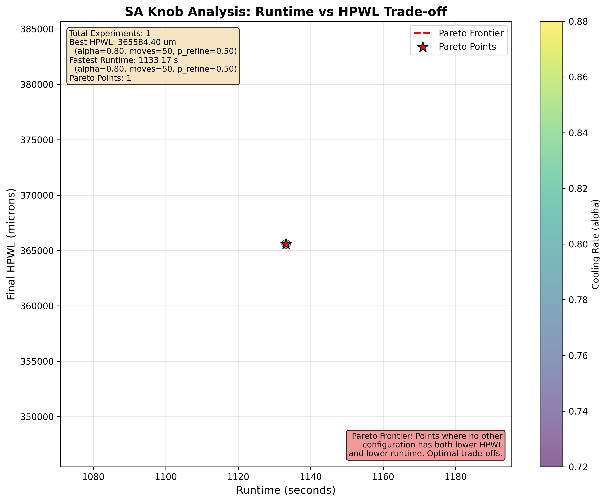

# structured_asic_project

Implementation of a complete physical design flow (Placement , CTS , Routing , and STA ) for a structured ASIC platform, as part of the [CSCE330401 - Digital Design II ] project.

## SA Knob Analysis

### Experiment Description

This analysis explores the impact of Simulated Annealing (SA) parameters on placement quality and runtime:

- **Cooling Rate (alpha)**: Controls temperature decay rate (0.80-0.99)
- **Moves per Temperature**: Number of moves attempted at each temperature (50-500)
- **P_refine**: Probability of using refine moves vs. explore moves (0.5-0.9)

The experiments systematically test combinations of these parameters to identify optimal trade-offs between placement quality (measured by Half-Perimeter Wirelength, HPWL) and runtime.

### Key Findings

To generate analysis results for a specific design, run:

```bash
python sa_knob_exploration.py --design <design_name>
```

This will:

1. Run experiments with all parameter combinations
2. Generate `sa_knob_analysis.png` showing the runtime vs. HPWL trade-off
3. Save results to `sa_knob_results_<design>.csv`
4. Print analysis with best configurations and recommendations

#### Best HPWL Configuration

The configuration that achieves the lowest HPWL (best placement quality).

#### Fastest Runtime Configuration

The configuration that completes placement in the shortest time.

#### Recommended Default Configuration

The configuration on the Pareto frontier that provides the best trade-off between quality and speed. This is recommended as the default for general use.

### Visualization

The analysis generates a scatter plot (`sa_knob_analysis.png`) showing:

- **X-axis**: Runtime (seconds)
- **Y-axis**: Final HPWL (microns)
- **Color-coding**: Points are colored by alpha value (cooling rate)
- **Pareto Frontier**: Red dashed line and star markers indicate Pareto-optimal configurations

**Pareto Frontier**: Points where no other configuration has both lower HPWL and lower runtime. These represent the best trade-offs between quality and speed.



_Note: Run the analysis script to generate the plot and see actual results for your design._
