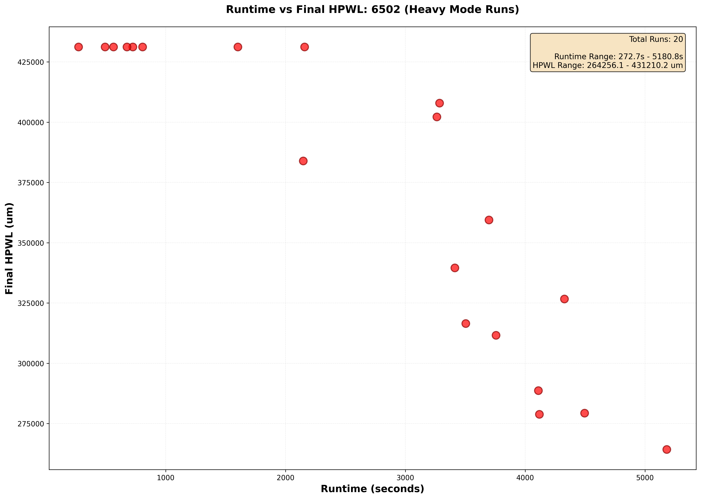
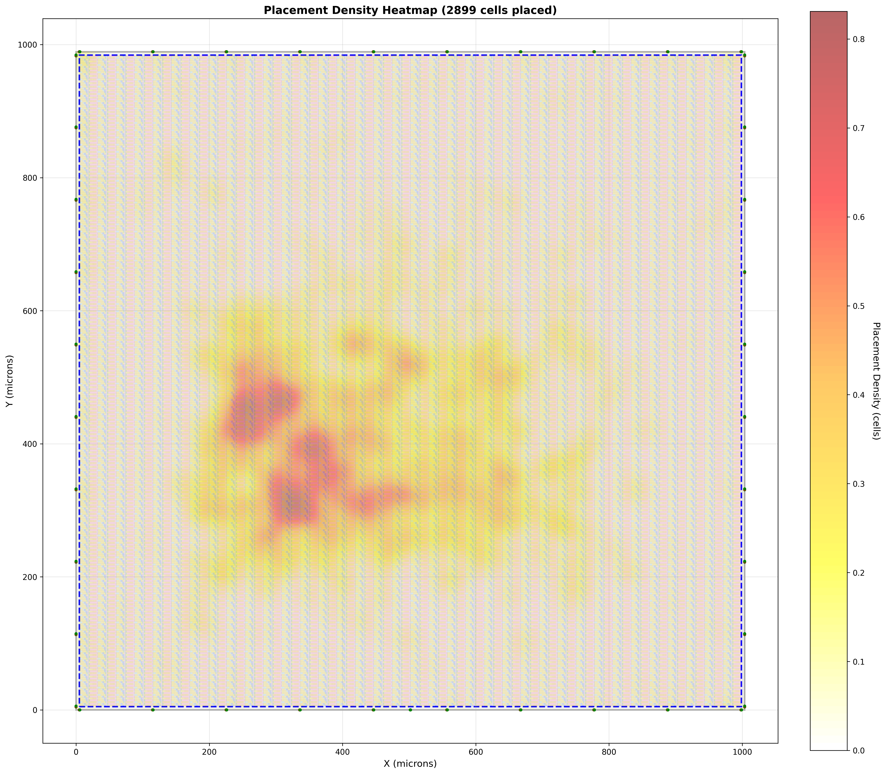
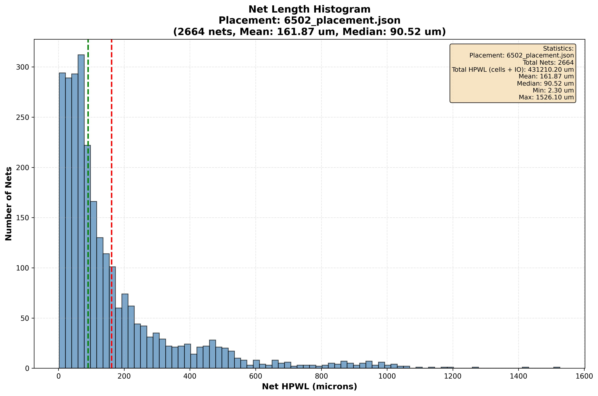
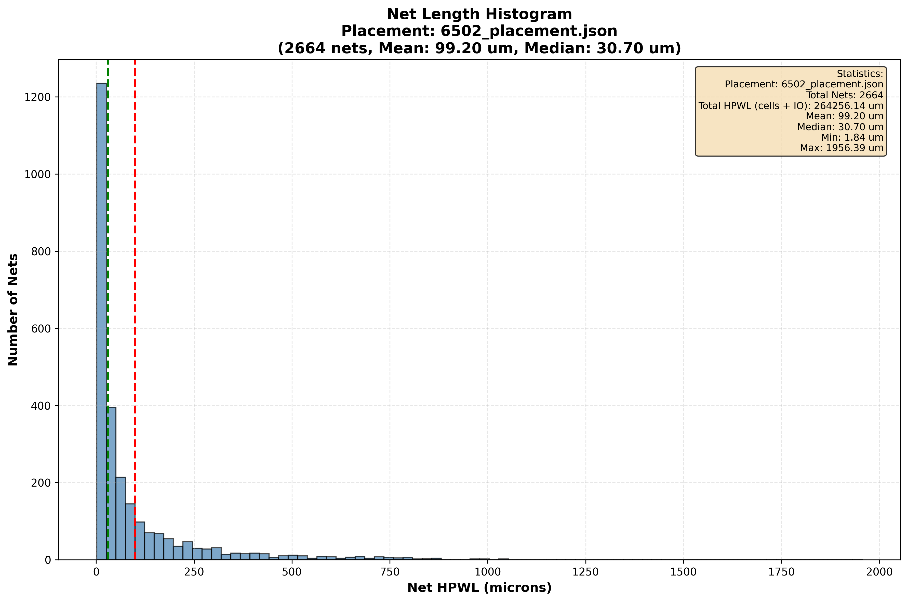

# Structured ASIC Physical Design Flow

Implementation of a complete physical design flow (Placement, CTS, Routing, and STA) for a structured ASIC platform, as part of the **[CSCE330401 - Digital Design II]** project.

---

## Project Overview

This project implements an optimized placement engine for mapping logical cells from synthesized designs onto physical fabric slots in a structured ASIC architecture. The placement flow consists of two main phases:

1. **Greedy Barycenter Placement** - Fast initial placement using connectivity-driven heuristics
2. **Simulated Annealing Optimization** - Iterative refinement to minimize wirelength

The primary optimization objective is to minimize **Half-Perimeter Wirelength (HPWL)**, which directly impacts routing congestion, timing, and power consumption.

---

## Design Flow Architecture

### Phase 1: Database Construction and Validation

#### **Core Parsing Modules**

**`parse_design.py`**

- **Input**: Yosys-generated mapped JSON file (e.g., `designs/6502_mapped.json`)
- **Output**:
  - `logical_db`: Dictionary mapping cell types to their instance counts
  - `netlist_graph`: Dictionary mapping instance names to their connections and types
- **Function**: Extracts the netlist connectivity, where each cell's connections are represented as lists of net IDs (integers) that define the electrical connectivity between components

**`parse_fabric.py`**

- **Input**: Fabric definition YAML files (`fabric/fabric_cells.yaml`, `fabric/pins.yaml`)
- **Output**:
  - `fabric_db`: Dictionary mapping cell types to lists of available physical slots with coordinates (x, y) in microns and orientations
  - `pins_db`: Dictionary containing die dimensions, core area, and fixed I/O pin locations
- **Function**: Builds the physical slot inventory and I/O pin database that defines the available placement locations

**`validator.py`**

- **Function**: Pre-placement validation ensuring:
  - All logical cell types in the design have corresponding fabric slots
  - Sufficient slots exist for each cell type (capacity check)
  - Design feasibility verification before attempting placement
- **Behavior**: Exits with error if validation fails, preventing invalid placements

**`visualize.py`**

- **Function**: Generates visual representations of:
  - Fabric slot layouts
  - Placement quality heatmaps
  - Net length distributions
  - Design analysis and debugging visualizations

---

### Phase 2: Greedy Barycenter Placement

The greedy algorithm establishes an initial high-quality placement using a two-stage approach:

#### **Stage 1: I/O-Connected Cell Placement (Seed Placement)**

**Function**: `place_io_connected_cells_optimized()`

- Identifies all cells directly connected to fixed I/O pins
- For each I/O cell, calculates the **barycenter** (center of gravity) of all connected pin locations
- Places each cell at the nearest available fabric slot to its barycenter
- **Purpose**: Minimizes I/O-to-logic wirelength, which is critical since I/O pins are fixed

**Key Optimization**: Uses KD-tree spatial indexing for O(log n) nearest-slot lookup instead of O(n) linear search

#### **Stage 2: Connectivity-Driven Placement**

**Function**: `place_greedy_barycenter_optimized()`

- Uses a priority queue where cells with more placed neighbors are prioritized
- For each unplaced cell:
  1. Find all already-placed neighbors (cells sharing nets)
  2. Calculate barycenter of neighbor positions
  3. Place at nearest available slot to the barycenter
  4. **Incrementally update** only affected cell priorities (not full recomputation)

**Scoring Function**: `(num_placed_neighbors, total_connections)`

- Primary: Maximize placed neighbors (ensures connected cells cluster together)
- Secondary: Total connection count (breaks ties)

**Key Optimizations**:

- Pre-built net-to-cells index for O(1) neighbor lookups
- Incremental score updates (only affected cells recalculated after each placement)
- KD-tree spatial indexing for fast nearest-slot searches
- Efficient handling of I/O pin connectivity in barycenter calculation

---

### Phase 3: Simulated Annealing Optimization

Simulated Annealing (SA) is a probabilistic optimization technique that refines the greedy placement by exploring the solution space through controlled randomness.

#### **Key Concept**

SA allows exploring better placements by occasionally accepting worse moves early on, enabling escape from local minima that greedy algorithms get trapped in.

#### **Algorithm Flow**

```
Initialize: T = T_initial, placement = greedy_placement, W = W_initial
while T > T_final:
    for i = 1 to moves_per_temp:
        1. Propose a move (refine or explore)
        2. Calculate ΔE = HPWL_new - HPWL_current
        3. Accept move if:
           - ΔE < 0 (improvement) → Always accept
           - ΔE ≥ 0 (worse) → Accept with probability P = e^(-ΔE/T)
        4. Update current placement if accepted
        5. Track best placement seen so far
    Cool temperature: T = α × T
    Shrink window: W = β × W
```

#### **Move Types (Hybrid Move Set)**

**Refine Move** (`refine_move_optimized()`) - Probability P_refine (default: 0.7)

- **Operation**: Swap two cells of the same type
- **Purpose**: Local optimization and fine-tuning
- **Characteristics**:
  - Preserves slot-type constraints (only swaps compatible cells)
  - Low-disruption moves for polishing placement
  - More effective at low temperatures

**Explore Move** (`explore_move_optimized()`) - Probability P_explore (default: 0.3)

- **Operation**: Move a cell to a random available slot within window W
- **Purpose**: Global exploration and escaping local minima
- **Characteristics**:
  - Window size W shrinks with temperature (β = 0.98)
  - Enables large jumps early, small adjustments late
  - Critical for discovering better placement regions

**Adaptive Strategy**:

- High temperature (early): More exploration moves accepted → global search
- Low temperature (late): Mostly refinement moves → fine-tuning
- Window cooling ensures spatial locality increases over time

#### **Acceptance Criterion (Metropolis)**

**Case 1**: If ΔE < 0 (improvement)

- **Always accept** - placement is better

**Case 2**: If ΔE ≥ 0 (worse placement)

- Accept with probability: **P = e^(-ΔE/T)**
- High T → High P → Accept many bad moves → Exploration
- Low T → Low P → Accept few bad moves → Refinement

#### **Cooling Schedule**

**Temperature**: T_new = α × T_old

- α ≈ 0.95–0.99 (typical range)
- Slower cooling (α closer to 1.0) = better quality, longer runtime
- Our default: α = 0.95

**Window Size**: W_new = β × W_old

- β ≈ 0.98 (default)
- Minimum window = 10% of die width (prevents over-localization)
- Initial window = 50% of die width

#### **Critical Optimizations**

**1. Incremental HPWL Calculation** (10-100× speedup)

- Original: Recalculate HPWL for **all nets** on every move
- Optimized: Only recalculate **affected nets** (nets connected to moved cells)
- Implementation:
  ```python
  affected_nets = get_affected_nets([cell1, cell2], cell_to_nets)
  delta_cost = calculate_incremental_delta(affected_nets, old_placement, new_placement)
  ```

**2. Pre-built Slot Lookup** (eliminates O(n) overhead)

- Built once before SA loop: `slot_lookup[slot_name] → slot_dict`
- Passed to all move functions
- Eliminates repeated fabric_db traversal

**3. Pre-computed Cell-to-Nets Mapping**

- `cell_to_nets[cell_name] → set(net_ids)`
- Enables O(1) lookup of which nets are affected by a move
- Critical for incremental HPWL calculation

**Expected Performance**: These optimizations reduce SA runtime from hours to minutes for typical designs.

---

## Visualization and Analysis Tools

### **Heatmap Generation** (`plot_fabric_with_placement.py`)

Generates placement quality heatmaps showing:

- Cell density distribution across the fabric
- Hotspot identification (over-utilized regions)
- Placement uniformity metrics
- Comparison between greedy and SA placements

### **Net Length Histograms** (`plot_net_length_histogram.py`)

Produces distribution plots of:

- HPWL per net (identifies critical nets)
- Net length statistics (mean, median, max)
- Comparison across different SA parameter configurations

### **Automated Parameter Sweep**

Runs multiple SA configurations with varying:

- `alpha`: Cooling rate (0.90–0.99)
- `moves_per_temp`: Iterations per temperature (50–1000)
- `T_final`: Stopping temperature (0.001–0.1)

Results stored in: `build/<design_name>/<SA_parameters>/`

Each run includes:

- `<config>_heatmap.png` - Placement heatmap
- `<design>.map` - Logical-to-physical mapping
- `<design>_placement.json` - Full placement data

Best run stored separately in: `build/<design_name>/Best_<config>/`

---

## Results: 6502 Microprocessor Design

### **Performance vs Quality Trade-off**



**Key Observations**:

- Diminishing returns with longer SA runs
- Sweet spot around α=0.99, moves=1000, T_final=0.001
- **38.72% HPWL improvement** over greedy-only placement (431,210.20 μm → 264,256.14 μm)
- Demonstrates effectiveness of SA in escaping local minima
- Detailed net length distribution analysis shown in histogram comparison below

### **Best Configuration Results**

**Parameters**: `alpha=0.99, moves_per_temp=1000, T_final=0.001`

**Heatmap Comparison**:

| Greedy Only                                             | After SA Optimization                                                                                            |
| ------------------------------------------------------- | ---------------------------------------------------------------------------------------------------------------- |
|  |  |

**Analysis**:

- Greedy placement shows clustering around I/O regions (expected from seed placement)
- SA redistributes cells more evenly across the fabric
- Hotspots reduced, indicating better load balancing
- Global exploration moves enabled discovery of non-intuitive but superior placements
- **HPWL Results**: 38.72% reduction (166,954.06 μm improvement) - see histogram analysis below for detailed distribution changes

### **Net Length Distribution**

| Greedy Placement                                        | After SA Optimization                                                                   |
| ------------------------------------------------------- | --------------------------------------------------------------------------------------- |
|  |  |

**Quantitative Results from Histogram Analysis**:

- **Total HPWL Reduction**: 38.72% improvement (431,210.20 μm → 264,256.14 μm)
- **Absolute Reduction**: 166,954.06 μm reduction in total wirelength
- **Distribution Shift**: SA histogram shows significant reduction in long net counts
- **Mean HPWL Reduction**: Visible decrease in average net length (see histogram statistics)
- **Long Net Optimization**: SA preferentially reduces nets in higher HPWL ranges (>500 μm)
- **⚠️ Trade-off - Maximum Net Length**: The maximum net length increases in SA-optimized placement, which is a negative aspect. While SA improves overall distribution and total HPWL, it may create a few extremely long nets as a side effect of global optimization

**Insights**:

- Most nets have short HPWL (good locality) in both placements, confirming good initial greedy placement
- Long-tail distribution indicates a few critical long nets that SA successfully optimizes
- **SA successfully reduces long net lengths more than short nets** - visible shift in distribution toward shorter nets
- Greedy placement shows more nets in the longer HPWL ranges (right tail of distribution)
- Distribution shift toward shorter nets in SA histogram confirms optimization effectiveness
- The contrast demonstrates SA's ability to escape local minima and find globally better placements
- **Key Observation**: The histogram comparison visually confirms the 38.72% total HPWL reduction, with the SA histogram showing fewer nets in high HPWL bins and more nets concentrated in lower HPWL ranges
- **Important Trade-off**: While SA dramatically improves total HPWL and average net lengths, the maximum net length increases. This is a known limitation where global optimization prioritizes overall wirelength reduction over eliminating the longest individual nets, which may impact timing-critical paths

---

## Command-Line Usage

### **Basic Placement (Greedy + SA)**

```bash
python placer.py --design designs/6502_mapped.json \
                 --fabric-cells fabric/fabric_cells.yaml \
                 --pins fabric/pins.yaml \
                 --output build/6502
```

### **Greedy Only (No SA)**

```bash
python placer.py --design designs/6502_mapped.json --no-sa
```

### **Custom SA Parameters**

```bash
python placer.py --design designs/6502_mapped.json \
                 --sa-alpha 0.99 \
                 --sa-moves 1000 \
                 --sa-T-final 0.001
```

### **Parameter Sweep**

```bash
python run_parameter_sweep.py --design designs/6502_mapped.json
```

---

## Output Files

### **Placement Map** (`<design>.map`)

```
cpu.U_alu.add_1 T0Y0__R0_NAND_42
cpu.U_alu.add_2 T0Y0__R0_NAND_43
...
```

Format: `logical_instance_name physical_slot_name`

### **Placement JSON** (`<design>_placement.json`)

```json
{
  "cpu.U_alu.add_1": {
    "fabric_slot_name": "T0Y0__R0_NAND_42",
    "x": 125.5,
    "y": 87.3,
    "orient": "N"
  },
  ...
}
```

### **Run Logs** (`build/<design>/logs/`)

- Detailed SA progress tracking
- Temperature, HPWL, acceptance rates per iteration
- Move type statistics (refine vs explore)
- Final improvement metrics

---

## Key Algorithmic Insights

### **Why Greedy Gets Stuck**

Greedy algorithms make locally optimal choices but can't backtrack:

- Once a cell is placed, it's fixed
- May create sub-optimal clusters that block better global arrangements
- No mechanism to escape local minima

### **How SA Escapes Local Minima**

1. **Early Phase (High T)**:

   - Accepts ~50% of worse moves
   - Explores radically different configurations
   - Discovers promising regions of solution space

2. **Middle Phase (Medium T)**:

   - Accepts ~20% of worse moves
   - Balances exploration with exploitation
   - Refines promising solutions while still exploring

3. **Late Phase (Low T)**:
   - Accepts <5% of worse moves
   - Fine-tunes final placement
   - Converges to local optimum (hopefully global)

### **Why Incremental HPWL is Critical**

**Without Optimization**:

- Each move touches 2 cells
- Those 2 cells might be on 10 nets total
- But we recalculate HPWL for ALL 10,000 nets in the design
- 99.9% of calculations are wasted!

**With Optimization**:

- Identify 10 affected nets
- Recalculate only those 10
- 1000× fewer calculations
- Same result, vastly faster

---

## References

- Yosys Open Synthesis Suite: [https://github.com/YosysHQ/yosys](https://github.com/YosysHQ/yosys)
- Simulated Annealing: Kirkpatrick, S., Gelatt, C. D., & Vecchi, M. P. (1983)
- VLSI Placement Algorithms: Kahng, A. B., Lienig, J., Markov, I. L., & Hu, J. (2011)

---

## Project Structure

```
structured_asic_project/
├── placer.py                          # Main placement engine
├── parse_design.py                     # Netlist parser
├── parse_fabric.py                     # Fabric definition parser
├── validator.py                        # Design feasibility checker
├── visualize.py                        # Visualization utilities
├── plot_fabric_with_placement.py      # Heatmap generator
├── plot_net_length_histogram.py       # Net distribution plots
├── run_parameter_sweep.py             # Automated SA tuning
├── fabric/
│   ├── fabric_cells.yaml              # Physical slot definitions
│   └── pins.yaml                       # I/O pin locations
├── designs/
│   └── 6502_mapped.json               # Example: 6502 microprocessor
└── build/
    └── 6502/
        ├── greedy/
            ├── greedy_heatmap.png          # Greedy-only heatmap
            └── greedyHisto.jpeg            # Greedy net length distribution
        ├── runtime_vs_hpwl_6502.png       # Performance analysis
        ├── logs/                           # Detailed run logs
        └── Best_sa_alpha0.99_moves1000_Tfinal0.001/
            ├── sa_alpha0.99_moves1000_Tfinal0.001_heatmap.png
            ├── histogram_final.png         # SA-optimized net length distribution
            ├── 6502.map
            └── 6502_placement.json
```
