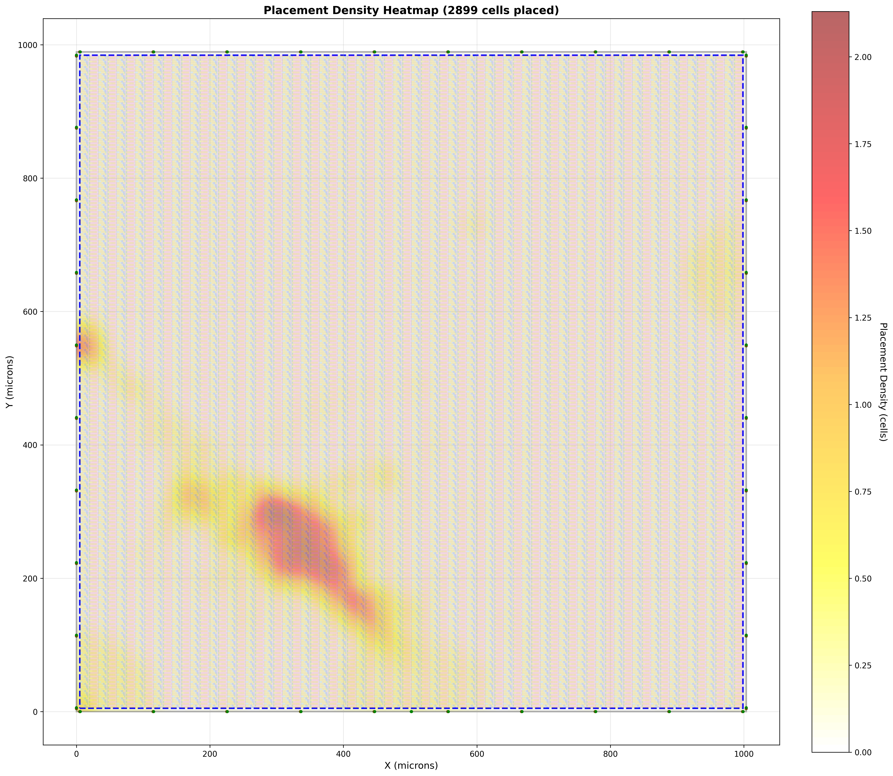
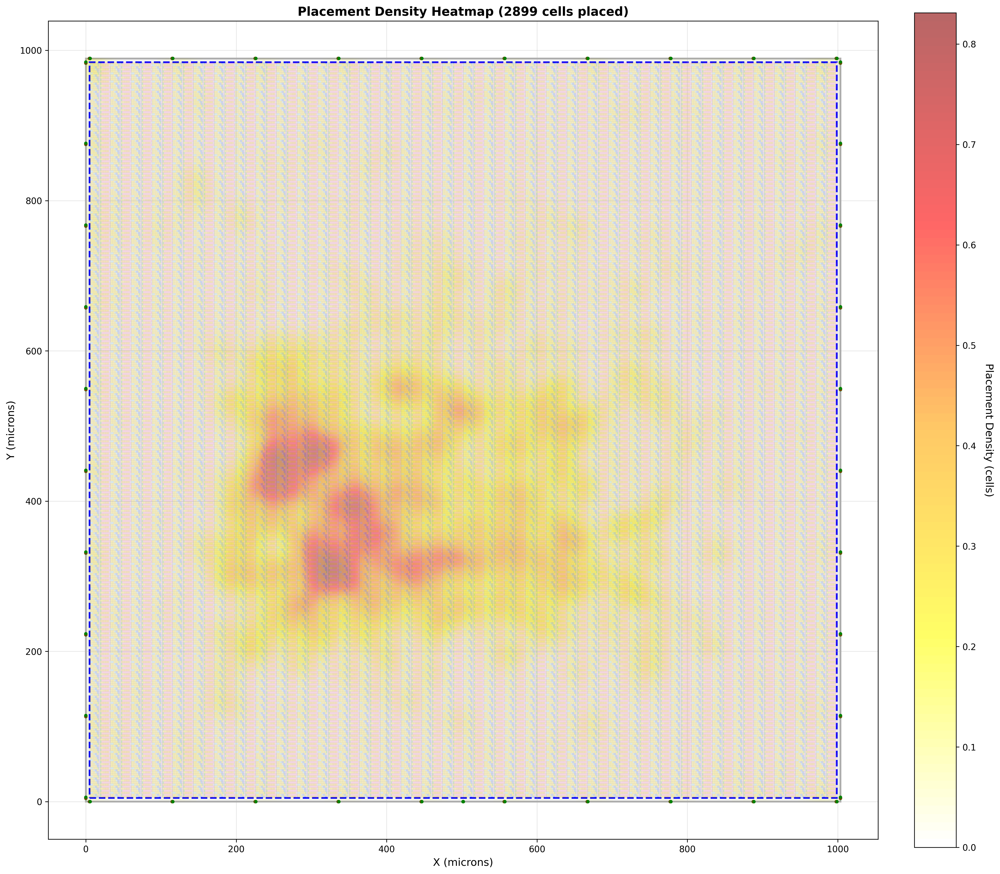
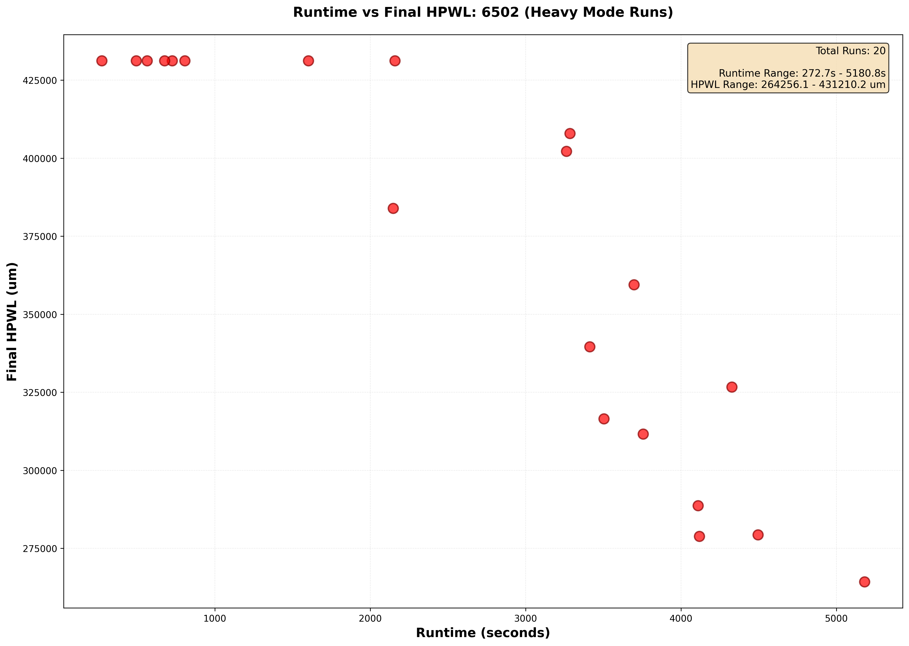
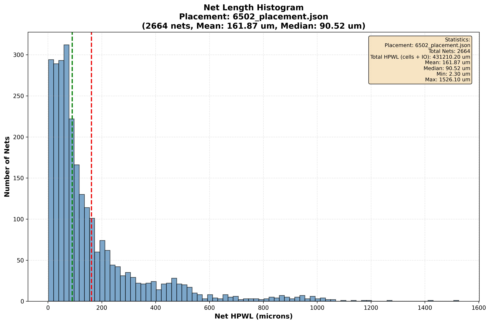
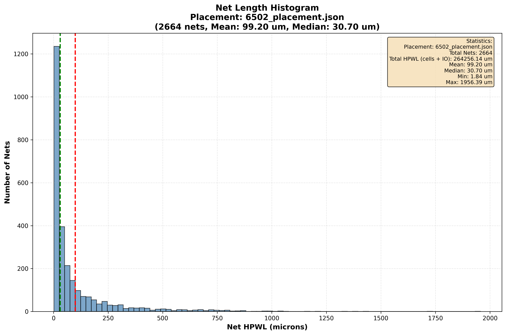

# Structured-ASIC Physical-Design Flow

> A complete VLSI back-end flow — **floorplanning, placement, clock-tree synthesis, routing, and static timing analysis** — for a structured-ASIC fabric on the SkyWater **Sky130** open PDK.

[](https://www.python.org/)
[](https://github.com/The-OpenROAD-Project/OpenROAD)
[](https://github.com/google/skywater-pdk)
[](LICENSE)

Built for **CSCE 3304 – Digital Design II** at the American University in Cairo. The flow takes a synthesized gate-level netlist, maps it onto fixed physical fabric slots, then optimizes, clocks, routes, and times the design end-to-end — the same backbone used in a commercial ASIC implementation flow.

## Highlights

- **−76.3 % total wirelength (HPWL)** on the 6502 CPU (426,853 µm → 101,347 µm) from an aggressively-tuned simulated-annealing schedule (6000 moves/temp, α=0.996) layered on a greedy barycenter placer.
- **Full back-end, RTL-to-signoff:** greedy + SA placement → CTS (H-tree / X-tree) → ECO → routing (OpenROAD) → parasitic (SPEF) extraction → static timing analysis; the routed design closes timing with positive setup & hold slack.
- **Incremental HPWL evaluation** makes simulated annealing **10–100× faster** by re-costing only the nets a move actually touches, plus KD-tree spatial indexing for nearest-slot lookups.
- **Four real designs** carried through the full flow: `6502`, `z80`, `aes_128`, and `arith`.

| Greedy placement | After simulated annealing |
| :---: | :---: |
|  |  |

*6502 cell-density heatmaps — simulated annealing redistributes cells off the I/O edges and reduces hotspots.*

> ⚠️ **Note on figures:** the heatmaps and histograms throughout this README are from an earlier, lighter run (α=0.99 / 1000 moves, −38.7% HPWL). The current best result is the **−76.3%** config below (α=0.996 / 6000 moves); those figures have **not** been regenerated yet, so the images do not visually reflect the −76.3% numbers.

## Tech Stack

**Languages:** Python, Tcl &nbsp;·&nbsp; **EDA tools:** OpenROAD, OpenSTA, Yosys (synthesis input) &nbsp;·&nbsp; **PDK:** SkyWater Sky130 &nbsp;·&nbsp; **Python libs:** NumPy, SciPy, Matplotlib

## Quick Start

```bash
# 1. Install Python dependencies
pip install -r requirements.txt

# 2. Run placement (greedy + SA) for the 6502 design
python placer.py --design designs/6502_mapped.json \
                 --fabric-cells fabric/fabric_cells.yaml \
                 --pins fabric/pins.yaml \
                 --output build/6502

# 3. Run the complete back-end flow: placement -> CTS -> route -> STA
#    (routing and STA require the OpenROAD binary on your PATH)
make all DESIGN=6502
```

Designs available: `DESIGN=6502 | z80 | aes_128 | arith`. See the [full flow walkthrough](#full-flow-walkthrough-inputs-and-outputs) below for every step, input, and output.

---

## Project Overview

This project implements an optimized placement engine that maps logical cells from synthesized designs onto physical fabric slots in a structured-ASIC architecture, then drives the result through clocking, routing, and timing signoff. The placement core has two phases:

1. **Greedy Barycenter Placement** — fast initial placement using connectivity-driven heuristics
2. **Simulated Annealing Optimization** — iterative refinement to minimize wirelength

The primary optimization objective is to minimize **Half-Perimeter Wirelength (HPWL)**, which directly impacts routing congestion, timing, and power.

---


# Full Flow Walkthrough: Inputs and Outputs

This document describes the complete physical design flow, starting from a logical netlist and ending with routed layout and static timing analysis. Each step depends on artifacts generated by the previous steps, so running `make all` or `make sta` will automatically execute the entire flow in the correct order.

---

## Initial Inputs (Required Files)

The following files must be present before running the flow:

- `designs/arith_mapped.json`  
  Logical design netlist (cells and connectivity)

- `fabric/fabric_cells.yaml`  
  Definitions of available fabric slots

- `fabric/pins.yaml`  
  Pin placement and I/O locations

- `tech/sky130_fd_sc_hd__tt_025C_1v80.lib`  
  Liberty timing library

- `tech/sky130_fd_sc_hd_merged.lef`  
  Technology LEF file

---

## Step 1: Greedy Placement (`make greedy`)

### Inputs
- `designs/arith_mapped.json` — design netlist  
- `fabric/fabric_cells.yaml` — fabric slot definitions  
- `fabric/pins.yaml` — pin locations  

### Outputs
- `build/arith/arith_placement.json`  
  Initial placement (logical cell → fabric slot mapping)

- `build/arith/arith.map`  
  Placement map file (logical_name → physical_slot_name)

### Description
Places logical cells onto available fabric slots using a greedy algorithm that minimizes estimated wirelength.

---

## Step 2: Simulated Annealing Placement (`make sa`)

### Inputs
- `build/arith/arith_placement.json` — initial placement from greedy step  
- `designs/arith_mapped.json` — design netlist  
- `fabric/fabric_cells.yaml` — fabric slots  
- `fabric/pins.yaml` — pin locations  

### Outputs
- `build/arith/arith_sa_placement.json`  
  Optimized placement after simulated annealing

- `build/arith/arith_sa.map`  
  Updated placement map (logical_name → physical_slot_name)

### Description
Improves the greedy placement using simulated annealing  
(α = 0.97, moves = 700, T_final = 0.001) to further reduce wirelength.

---

## Step 3: Clock Tree Synthesis (CTS) & ECO (`make cts_eco`)

### Inputs
- `build/arith/arith_sa_placement.json` — SA placement  
- `build/arith/arith_sa.map` — placement map (required for CTS)  
- `designs/arith_mapped.json` — design netlist  
- `fabric/fabric_cells.yaml` — fabric cells  

### Outputs
- `build/arith/arith_eco.json`  
  Placement JSON with CTS buffers and ECO cells added

- `build/arith/arith_eco.v` (or `arith_final.v`)  
  Verilog netlist including CTS and ECO modifications

- `build/arith/arith_eco.map`  
  Placement map including CTS buffers and ECO cells

### Description
- Generates a clock tree (H-tree) and inserts clock buffers  
- Adds ECO cells (e.g., tying unused logic to `conb_1 LO`)  
- Updates both placement and netlist to reflect newly added cells

---

## Step 4: Instance Renaming (`make rename`)

### Inputs
- `build/arith/arith_eco.v` or `build/arith/arith_final.v`  
  Verilog netlist with logical instance names

- `build/arith/arith_eco.map`  
  Placement map (logical → physical mapping)

### Outputs
- `build/arith/arith_renamed.v`  
  Verilog netlist with instances renamed to physical slot names

### Description
Renames all Verilog instances from logical names to physical slot names  
(e.g., `cell_123 → T14Y58__R1_DFBBP_0`) to ensure consistency with the placed design.

---

## Step 5: Routing (`make route`)

### Inputs
- `build/arith/arith_renamed.v` — renamed Verilog  
- `build/arith/arith_eco.map` — placement map  
- `tech/sky130_fd_sc_hd_merged.lef` — technology LEF  
- `tech/sky130_fd_sc_hd__tt_025C_1v80.lib` — liberty timing library  

### Process
1. `make_def.py` generates an initial DEF:
   - `build/arith/arith.def` (components, pins, nets — no routing)

2. `route.tcl` (OpenROAD) performs:
   - Global routing  
   - Detailed routing  
   - SPEF extraction  

### Outputs
- `build/arith/arith.def`  
  Initial DEF file (unrouted)

- `build/arith/arith_routed.def`  
  Final DEF with complete routing (metal layers, tracks, vias)

- `build/arith/arith.spef`  
  Extracted parasitic RC data (SPEF)

### Description
Routes all nets through metal layers, creating complete physical wire connections between cells.

---

## Step 6: Static Timing Analysis (STA) (`make sta`)

### Inputs
- `build/arith/arith_routed.def` — routed design  
- `build/arith/arith_renamed.v` — renamed Verilog  
- `build/arith/arith.spef` — parasitic RC data  
- `tech/sky130_fd_sc_hd_merged.lef` — technology LEF  
- `tech/sky130_fd_sc_hd__tt_025C_1v80.lib` — timing library  
- `sdc/arith.sdc` — timing constraints  

### Outputs
- `build/arith/arith_setup.rpt`  
  Setup timing report

- `build/arith/arith_hold.rpt`  
  Hold timing report

- `build/arith/arith_clock_skew.rpt`  
  Clock skew analysis

- `build/arith/arith_timing_summary.rpt`  
  Overall timing summary

### Description
Analyzes timing paths, computes delays using extracted parasitics, checks setup and hold constraints, and reports worst-case timing and slack.

---

## Summary Flow Diagram

```text
designs/arith_mapped.json
fabric/fabric_cells.yaml
fabric/pins.yaml
        ↓
[ Step 1: Greedy Placement ]
        ↓
arith_placement.json
arith.map
        ↓
[ Step 2: Simulated Annealing ]
        ↓
arith_sa_placement.json
arith_sa.map
        ↓
[ Step 3: CTS & ECO ]
        ↓
arith_eco.json
arith_eco.v / arith_final.v
arith_eco.map
        ↓
[ Step 4: Instance Rename ]
        ↓
arith_renamed.v
        ↓
[ Step 5: Routing ]
        ↓
arith_routed.def
arith.spef
        ↓
[ Step 6: STA ]
        ↓
arith_setup.rpt
arith_hold.rpt
arith_clock_skew.rpt
arith_timing_summary.rpt
```

---

## Key Features

### Clock Tree Synthesis (CTS)
Complete CTS implementation with automatic buffer management ([`eco_generator.py --enable-cts`](eco_generator.py)):
- **H-Tree** (`--cts-tree-type h`): balanced horizontal/vertical partitioning
- **X-Tree** (`--cts-tree-type x`): diagonal NW/SE and NE/SW partitioning
- **Buffer Manager** ([`buffer_manager.py`](buffer_manager.py)): allocates clock buffers from available fabric slots

### OpenROAD Routing & STA
- Global + detailed routing with SPEF parasitic extraction ([`route.tcl`](route.tcl))
- Setup/hold, clock-skew, and summary timing reports ([`sta.tcl`](sta.tcl))

### Visualizations & Animations
The flow renders placement heatmaps, net-length histograms, critical-path views, and slack histograms. Rendered MP4 walkthroughs of SA placement and the H-tree / X-tree clock networks are checked in under [`Animations/`](Animations/).

---

## Design Flow Architecture

### Phase 1: Database Construction and Validation

#### **Core Parsing Modules**

**`parse_design.py`**

- **Input**: Yosys-generated mapped JSON file (e.g., `designs/6502_mapped.json`)
- **Output**:
  - `logical_db`: Dictionary mapping cell types to their instance counts
  - `netlist_graph`: Dictionary mapping instance names to their connections and types
- **Function**: Extracts the netlist connectivity, where each cell's connections are represented as lists of net IDs (integers) that define the electrical connectivity between components

**`parse_fabric.py`**

- **Input**: Fabric definition YAML files (`fabric/fabric_cells.yaml`, `fabric/pins.yaml`)
- **Output**:
  - `fabric_db`: Dictionary mapping cell types to lists of available physical slots with coordinates (x, y) in microns and orientations
  - `pins_db`: Dictionary containing die dimensions, core area, and fixed I/O pin locations
- **Function**: Builds the physical slot inventory and I/O pin database that defines the available placement locations

**`validator.py`**

- **Function**: Pre-placement validation ensuring:
  - All logical cell types in the design have corresponding fabric slots
  - Sufficient slots exist for each cell type (capacity check)
  - Design feasibility verification before attempting placement
- **Behavior**: Exits with error if validation fails, preventing invalid placements

**`visualize.py`**

- **Function**: Generates visual representations of:
  - Fabric slot layouts
  - Placement quality heatmaps
  - Net length distributions
  - Design analysis and debugging visualizations

---

### Phase 2: Greedy Barycenter Placement

The greedy algorithm establishes an initial high-quality placement using a two-stage approach:

#### **Stage 1: I/O-Connected Cell Placement (Seed Placement)**

**Function**: `place_io_connected_cells_optimized()`

- Identifies all cells directly connected to fixed I/O pins
- For each I/O cell, calculates the **barycenter** (center of gravity) of all connected pin locations
- Places each cell at the nearest available fabric slot to its barycenter
- **Purpose**: Minimizes I/O-to-logic wirelength, which is critical since I/O pins are fixed

**Key Optimization**: Uses KD-tree spatial indexing for O(log n) nearest-slot lookup instead of O(n) linear search

#### **Stage 2: Connectivity-Driven Placement**

**Function**: `place_greedy_barycenter_optimized()`

- Uses a priority queue where cells with more placed neighbors are prioritized
- For each unplaced cell:
  1. Find all already-placed neighbors (cells sharing nets)
  2. Calculate barycenter of neighbor positions
  3. Place at nearest available slot to the barycenter
  4. **Incrementally update** only affected cell priorities (not full recomputation)

**Scoring Function**: `(num_placed_neighbors, total_connections)`

- Primary: Maximize placed neighbors (ensures connected cells cluster together)
- Secondary: Total connection count (breaks ties)

**Key Optimizations**:

- Pre-built net-to-cells index for O(1) neighbor lookups
- Incremental score updates (only affected cells recalculated after each placement)
- KD-tree spatial indexing for fast nearest-slot searches
- Efficient handling of I/O pin connectivity in barycenter calculation

---

### Phase 3: Simulated Annealing Optimization

Simulated Annealing (SA) is a probabilistic optimization technique that refines the greedy placement by exploring the solution space through controlled randomness.

#### **Key Concept**

SA allows exploring better placements by occasionally accepting worse moves early on, enabling escape from local minima that greedy algorithms get trapped in.

#### **Algorithm Flow**

```
Initialize: T = T_initial, placement = greedy_placement, W = W_initial
while T > T_final:
    for i = 1 to moves_per_temp:
        1. Propose a move (refine or explore)
        2. Calculate ΔE = HPWL_new - HPWL_current
        3. Accept move if:
           - ΔE < 0 (improvement) → Always accept
           - ΔE ≥ 0 (worse) → Accept with probability P = e^(-ΔE/T)
        4. Update current placement if accepted
        5. Track best placement seen so far
    Cool temperature: T = α × T
    Shrink window: W = β × W
```

#### **Move Types (Hybrid Move Set)**

**Refine Move** (`refine_move_optimized()`) - Probability P_refine (default: 0.7)

- **Operation**: Swap two cells of the same type
- **Purpose**: Local optimization and fine-tuning
- **Characteristics**:
  - Preserves slot-type constraints (only swaps compatible cells)
  - Low-disruption moves for polishing placement
  - More effective at low temperatures

**Explore Move** (`explore_move_optimized()`) - Probability P_explore (default: 0.3)

- **Operation**: Move a cell to a random available slot within window W
- **Purpose**: Global exploration and escaping local minima
- **Characteristics**:
  - Window size W shrinks with temperature (β = 0.98)
  - Enables large jumps early, small adjustments late
  - Critical for discovering better placement regions

**Adaptive Strategy**:

- High temperature (early): More exploration moves accepted → global search
- Low temperature (late): Mostly refinement moves → fine-tuning
- Window cooling ensures spatial locality increases over time

#### **Acceptance Criterion (Metropolis)**

**Case 1**: If ΔE < 0 (improvement)

- **Always accept** - placement is better

**Case 2**: If ΔE ≥ 0 (worse placement)

- Accept with probability: **P = e^(-ΔE/T)**
- High T → High P → Accept many bad moves → Exploration
- Low T → Low P → Accept few bad moves → Refinement

#### **Cooling Schedule**

**Temperature**: T_new = α × T_old

- α ≈ 0.95–0.99 (typical range)
- Slower cooling (α closer to 1.0) = better quality, longer runtime
- Our default: α = 0.95

**Window Size**: W_new = β × W_old

- β ≈ 0.98 (default)
- Minimum window = 10% of die width (prevents over-localization)
- Initial window = 50% of die width

#### **Critical Optimizations**

**1. Incremental HPWL Calculation** (10-100× speedup)

- Original: Recalculate HPWL for **all nets** on every move
- Optimized: Only recalculate **affected nets** (nets connected to moved cells)
- Implementation:
  ```python
  affected_nets = get_affected_nets([cell1, cell2], cell_to_nets)
  delta_cost = calculate_incremental_delta(affected_nets, old_placement, new_placement)
  ```

**2. Pre-built Slot Lookup** (eliminates O(n) overhead)

- Built once before SA loop: `slot_lookup[slot_name] → slot_dict`
- Passed to all move functions
- Eliminates repeated fabric_db traversal

**3. Pre-computed Cell-to-Nets Mapping**

- `cell_to_nets[cell_name] → set(net_ids)`
- Enables O(1) lookup of which nets are affected by a move
- Critical for incremental HPWL calculation

**Expected Performance**: These optimizations reduce SA runtime from hours to minutes for typical designs.

---

### Phase 4: Clock Tree Synthesis, ECO, and Instance Renaming

After placement optimization, the design undergoes clock tree synthesis, engineering change orders, and instance renaming to prepare for routing.

#### **Clock Tree Synthesis (CTS)**

**Function**: `eco_generator.py` with `--enable-cts`

- **Purpose**: Distributes clock signals from a single source to all sequential elements (flip-flops, latches) with balanced delays
- **Implementation**: Supports two tree topologies:
  - **H-Tree** (`--cts-tree-type h`): Balanced horizontal/vertical partitioning for uniform clock distribution
  - **X-Tree** (`--cts-tree-type x`): Diagonal NW/SE and NE/SW partitioning for alternative routing patterns
- **Buffer Management**: Automatically allocates clock buffers (`clkbuf_4`, `clkinv_2`) from available fabric slots
- **Output**: Adds clock buffer instances to the placement and updates the netlist with clock tree connections

**Key Files**:
- `cts_api.py` - CTS API interface
- `cts_htree.py` - H-Tree implementation
- `cts_xtree.py` - X-Tree implementation
- `buffer_manager.py` - Buffer allocation from fabric slots

#### **Engineering Change Order (ECO)**

**Function**: `eco_generator.py`

- **Purpose**: Adds necessary cells to ensure design correctness and manufacturability
- **Common ECO Operations**:
  - Tying unused logic inputs to constant values (e.g., `conb_1 LO` for tie-low)
  - Adding decoupling capacitors (`decap_3`, `decap_4`) for power integrity
  - Inserting tap cells (`tapvpwrvgnd_1`) for substrate biasing
- **Output**: 
  - `build/<design>/<design>_eco.json` - Updated placement including ECO cells
  - `build/<design>/<design>_eco.v` - Verilog netlist with CTS and ECO modifications
  - `build/<design>/<design>_eco.map` - Placement map including all new cells

#### **Instance Renaming (`rename.py`)**

**Function**: `rename.py` (or `make rename`)

- **Purpose**: Maps logical instance names from synthesis to physical slot names from placement
- **Process**:
  1. Reads placement map (`<design>_eco.map`) containing logical → physical mappings
  2. Parses Verilog netlist (`<design>_eco.v`) with logical instance names
  3. Renames all instances to match physical slot names (e.g., `cell_123 → T14Y58__R1_DFBBP_0`)
- **Why Required**: Routing tools (OpenROAD) need physical slot names to match the DEF file generated from placement
- **Output**: `build/<design>/<design>_renamed.v` - Verilog with physical instance names

**Key Validation**:
- Ensures all logical instances in Verilog have corresponding entries in the placement map
- Verifies no duplicate physical slot assignments
- Checks that renamed instances match DEF file component names

---

### Phase 5: Routing and Static Timing Analysis

The final phases convert the placed and renamed design into a fully routed layout and perform timing verification.

#### **Routing (`route.tcl`)**

**Function**: OpenROAD routing script (`route.tcl`)

- **Purpose**: Creates physical wire connections between all placed cells using metal layers
- **Two-Stage Process**:

  1. **Global Routing**:
     - Divides the design into routing grid cells (GCells)
     - Assigns nets to routing tracks and layers
     - Generates routing guides (coarse paths) for each net
     - Produces congestion analysis and reports
     - Output: `build/<design>/<design>_global_routed.def`

  2. **Detailed Routing**:
     - Implements actual metal wires, vias, and connections following global routing guides
     - Performs DRC (Design Rule Check) compliance
     - Handles pin access and via generation
     - Iterative repair for routing violations
     - Output: `build/<design>/<design>_routed.def`

- **Parasitic Extraction**:
  - Extracts resistance and capacitance (RC) values from routed wires
  - Uses extraction rules file (`rcx_patterns.rules`) for accurate modeling
  - Output: `build/<design>/<design>.spef` (Standard Parasitic Exchange Format)

**Key Features**:
- Automatic error recovery with iterative routing attempts
- Pin access analysis before routing
- Congestion-aware routing with overflow handling
- Support for multiple metal layers (met1-met5 in Sky130)

**Usage**:
```bash
export DESIGN_NAME=6502
export BUILD_DIR=build
export LIBERTY_FILE=tech/sky130_fd_sc_hd__tt_025C_1v80.lib
export LEF_FILE=tech/sky130_fd_sc_hd_merged.lef
openroad -exit route.tcl
```

#### **Static Timing Analysis (`sta.tcl`)**

**Function**: OpenROAD/OpenSTA timing analysis script (`sta.tcl`)

- **Purpose**: Verifies that the routed design meets timing constraints (setup, hold, clock skew)
- **Inputs Required**:
  - `build/<design>/<design>_renamed.v` - Renamed Verilog netlist
  - `build/<design>/<design>.spef` - Extracted parasitic RC data
  - `sdc/<design>.sdc` - Timing constraints (clock definitions, input/output delays)
  - `tech/sky130_fd_sc_hd_merged.lef` - Technology LEF
  - `tech/sky130_fd_sc_hd__tt_025C_1v80.lib` - Liberty timing library

- **Analysis Performed**:
  1. **Setup Time Checks**: Verifies data arrives before clock edge (max delay paths)
  2. **Hold Time Checks**: Verifies data remains stable after clock edge (min delay paths)
  3. **Clock Skew Analysis**: Measures clock arrival time differences across the design
  4. **Timing Summary**: Overall timing metrics and worst-case paths

- **Output Reports**:
  - `build/<design>/<design>_setup.rpt` - Setup timing violations and worst paths
  - `build/<design>/<design>_hold.rpt` - Hold timing violations
  - `build/<design>/<design>_clock_skew.rpt` - Clock distribution analysis
  - `build/<design>/<design>_timing_summary.rpt` - Overall timing summary

**Key Metrics Reported**:
- Slack (positive = meets timing, negative = violation)
- Path delay (propagation time through combinational logic)
- Clock-to-Q delay (sequential element output delay)
- Setup/Hold time margins

**Usage**:
```bash
export DESIGN_NAME=6502
export BUILD_DIR=build
export LIBERTY_FILE=tech/sky130_fd_sc_hd__tt_025C_1v80.lib
export SDC_FILE=sdc/6502.sdc
openroad -exit sta.tcl
```

**Timing Closure Flow**:
If timing violations are found, the design may need:
- Placement refinement (re-run SA with timing-aware objectives)
- Buffer insertion for long paths
- Clock tree optimization
- Constraint relaxation (if over-constrained)

---

## Visualization and Analysis Tools

### **Placement & Fabric Visualization** ([`visualize.py`](visualize.py))

Generates fabric layouts and placement-quality heatmaps showing:

- Cell density distribution across the fabric
- Hotspot identification (over-utilized regions)
- Net-length distributions and design-analysis plots
- Comparison between greedy and SA placements

### **Timing Visualization** ([`visualize_timing.py`](visualize_timing.py), [`visualize_critical_path.py`](visualize_critical_path.py), [`visualize_slack_histogram.py`](visualize_slack_histogram.py))

Renders post-STA timing views:

- Worst-case critical paths over the placed layout
- Slack histograms across all timing endpoints
- Per-stage delay breakdowns

### **Automated Parameter Sweep** ([`sa_knob_exploration.py`](sa_knob_exploration.py))

Runs multiple SA configurations with varying:

- `alpha`: Cooling rate (0.90–0.99)
- `moves_per_temp`: Iterations per temperature (50–1000)
- `T_final`: Stopping temperature (0.001–0.1)

Results stored in: `build/<design_name>/<SA_parameters>/`

Each run includes:

- `<config>_heatmap.png` - Placement heatmap
- `<design>.map` - Logical-to-physical mapping
- `<design>_placement.json` - Full placement data

Best run stored separately in: `build/<design_name>/Best_<config>/`

---

## Results: 6502 Microprocessor Design

### **Best Result: −76.3% HPWL**

The strongest fully-completed SA run reduces total wirelength by **76.26%** on the 6502 CPU. HPWL falls monotonically as the cooling schedule is made more aggressive (more moves/temp, slower cooling):

| Config (moves / α) | Final HPWL | Reduction | Log |
| ------------------ | ---------- | --------- | --- |
| 2500 / 0.975       | 261,635 µm | 38.71%    | `build/6502/logs/config_04_m2500_T0.0007_a0.975.log` |
| 4000 / 0.99        | 161,472 µm | 62.17%    | `build/6502/logs/config_07_m4000_T0.0004_a0.99.log` |
| 5000 / 0.994       | 119,243 µm | 72.06%    | `build/6502/logs/config_09_m5000_T0.0002_a0.994.log` |
| 5500 / 0.995       | 108,668 µm | 74.54%    | `build/6502/logs/config_10_m5500_T0.00015_a0.995.log` |
| **6000 / 0.996**   | **101,347 µm** | **76.26%** | `build/6502/logs/config_11_m6000_T0.00012_a0.996.log` |

Greedy baseline (SA initial): **426,853 µm** → best SA: **101,347 µm** (−325,506 µm). The trade-off is runtime: the best config runs millions of moves and takes substantially longer than the lighter schedules.

### **Performance vs Quality Trade-off**



**Key Observations**:

- HPWL keeps improving with longer SA runs (more moves/temp + slower cooling), at the cost of runtime
- **Best completed run: 76.26% HPWL improvement** over greedy-only placement (426,853 µm → 101,347 µm)
- Demonstrates the effectiveness of SA in escaping local minima
- Detailed net-length distribution analysis shown in the histogram comparison below

### **Figure Set (earlier −38.7% run)**

> The heatmaps and histograms in this subsection are from the earlier `alpha=0.99, moves_per_temp=1000, T_final=0.001` run (−38.7% HPWL). They illustrate the *qualitative* greedy-vs-SA effect but predate the −76.3% best config above; updated figures have not been regenerated.

**Parameters**: `alpha=0.99, moves_per_temp=1000, T_final=0.001`

**Heatmap Comparison**:

| Greedy Only                                             | After SA Optimization                                                                                            |
| ------------------------------------------------------- | ---------------------------------------------------------------------------------------------------------------- |
|  |  |

**Analysis**:

- Greedy placement shows clustering around I/O regions (expected from seed placement)
- SA redistributes cells more evenly across the fabric
- Hotspots reduced, indicating better load balancing
- Global exploration moves enabled discovery of non-intuitive but superior placements
- **HPWL Results**: 38.72% reduction (166,954.06 μm improvement) - see histogram analysis below for detailed distribution changes

### **Net Length Distribution**

| Greedy Placement                                        | After SA Optimization                                                                   |
| ------------------------------------------------------- | --------------------------------------------------------------------------------------- |
|  |  |

**Quantitative Results from Histogram Analysis**:

- **Total HPWL Reduction**: 38.72% improvement (431,210.20 μm → 264,256.14 μm)
- **Absolute Reduction**: 166,954.06 μm reduction in total wirelength
- **Distribution Shift**: SA histogram shows significant reduction in long net counts
- **Mean HPWL Reduction**: Visible decrease in average net length (see histogram statistics)
- **Long Net Optimization**: SA preferentially reduces nets in higher HPWL ranges (>500 μm)
- **⚠️ Trade-off - Maximum Net Length**: The maximum net length increases in SA-optimized placement, which is a negative aspect. While SA improves overall distribution and total HPWL, it may create a few extremely long nets as a side effect of global optimization

**Insights**:

- Most nets have short HPWL (good locality) in both placements, confirming good initial greedy placement
- Long-tail distribution indicates a few critical long nets that SA successfully optimizes
- **SA successfully reduces long net lengths more than short nets** - visible shift in distribution toward shorter nets
- Greedy placement shows more nets in the longer HPWL ranges (right tail of distribution)
- Distribution shift toward shorter nets in SA histogram confirms optimization effectiveness
- The contrast demonstrates SA's ability to escape local minima and find globally better placements
- **Key Observation**: The histogram comparison visually confirms the 38.72% total HPWL reduction, with the SA histogram showing fewer nets in high HPWL bins and more nets concentrated in lower HPWL ranges
- **Important Trade-off**: While SA dramatically improves total HPWL and average net lengths, the maximum net length increases. This is a known limitation where global optimization prioritizes overall wirelength reduction over eliminating the longest individual nets, which may impact timing-critical paths

---

## Command-Line Usage

### **Basic Placement (Greedy + SA)**

```bash
python placer.py --design designs/6502_mapped.json \
                 --fabric-cells fabric/fabric_cells.yaml \
                 --pins fabric/pins.yaml \
                 --output build/6502
```

### **Greedy Only (No SA)**

```bash
python placer.py --design designs/6502_mapped.json --no-sa
```

### **Custom SA Parameters**

```bash
python placer.py --design designs/6502_mapped.json \
                 --sa-alpha 0.99 \
                 --sa-moves 1000 \
                 --sa-T-final 0.001
```

### **Parameter Sweep**

```bash
python sa_knob_exploration.py --design designs/6502_mapped.json
```

---

## Output Files

### **Placement Map** (`<design>.map`)

```
cpu.U_alu.add_1 T0Y0__R0_NAND_42
cpu.U_alu.add_2 T0Y0__R0_NAND_43
...
```

Format: `logical_instance_name physical_slot_name`

### **Placement JSON** (`<design>_placement.json`)

```json
{
  "cpu.U_alu.add_1": {
    "fabric_slot_name": "T0Y0__R0_NAND_42",
    "x": 125.5,
    "y": 87.3,
    "orient": "N"
  },
  ...
}
```

### **Run Logs** (`build/<design>/logs/`)

- Detailed SA progress tracking
- Temperature, HPWL, acceptance rates per iteration
- Move type statistics (refine vs explore)
- Final improvement metrics

---

## Key Algorithmic Insights

### **Why Greedy Gets Stuck**

Greedy algorithms make locally optimal choices but can't backtrack:

- Once a cell is placed, it's fixed
- May create sub-optimal clusters that block better global arrangements
- No mechanism to escape local minima

### **How SA Escapes Local Minima**

1. **Early Phase (High T)**:

   - Accepts ~50% of worse moves
   - Explores radically different configurations
   - Discovers promising regions of solution space

2. **Middle Phase (Medium T)**:

   - Accepts ~20% of worse moves
   - Balances exploration with exploitation
   - Refines promising solutions while still exploring

3. **Late Phase (Low T)**:
   - Accepts <5% of worse moves
   - Fine-tunes final placement
   - Converges to local optimum (hopefully global)

### **Why Incremental HPWL is Critical**

**Without Optimization**:

- Each move touches 2 cells
- Those 2 cells might be on 10 nets total
- But we recalculate HPWL for ALL 10,000 nets in the design
- 99.9% of calculations are wasted!

**With Optimization**:

- Identify 10 affected nets
- Recalculate only those 10
- 1000× fewer calculations
- Same result, vastly faster

---

## References

- Yosys Open Synthesis Suite: [https://github.com/YosysHQ/yosys](https://github.com/YosysHQ/yosys)
- Simulated Annealing: Kirkpatrick, S., Gelatt, C. D., & Vecchi, M. P. (1983)
- VLSI Placement Algorithms: Kahng, A. B., Lienig, J., Markov, I. L., & Hu, J. (2011)

---

## Project Structure

```
structured_asic_project/
├── Makefile                            # Drives the full flow (make all DESIGN=...)
│
├── placer.py                           # Placement engine (greedy + simulated annealing)
├── parse_design.py                     # Netlist (mapped JSON) parser
├── parse_fabric.py                     # Fabric / pin definition parser
├── validator.py                        # Pre-placement feasibility checker
├── sa_knob_exploration.py              # Automated SA parameter sweep
│
├── eco_generator.py                    # CTS + ECO insertion, netlist update
├── cts_api.py                          # CTS API
├── cts_htree.py                        # H-Tree implementation
├── cts_xtree.py                        # X-Tree implementation
├── cts_simulator.py                    # CTS timing simulation
├── cts_with_buffer_manager.py          # CTS driver using the buffer manager
├── buffer_manager.py                   # Clock-buffer allocation from fabric slots
│
├── rename.py                           # Logical -> physical instance renaming
├── make_def.py                         # DEF generator (components, pins, nets)
├── route.tcl / run_route.tcl           # OpenROAD global + detailed routing
├── sta.tcl                             # OpenROAD/OpenSTA timing analysis
├── synthesis.tcl                       # Yosys synthesis script
├── view_routed.tcl                     # OpenROAD GUI viewer for routed DEF
│
├── visualize.py                        # Fabric layout & placement heatmaps
├── visualize_timing.py                 # Timing visualizations
├── visualize_critical_path.py          # Critical-path rendering
├── visualize_slack_histogram.py        # Slack histogram
│
├── Helper & Temp scripts/              # Auxiliary helper scripts (auto_route, etc.)
│
├── designs/                            # Mapped netlists: 6502, z80, aes_128, arith
├── fabric/                             # fabric_cells.yaml, pins.yaml
├── tech/                               # Sky130 LEF + Liberty timing library
├── sdc/                                # Timing constraints (.sdc)
├── Animations/                         # Rendered MP4 walkthroughs (SA, H-tree, X-tree)
├── Results & Graphs/                   # Exported figures and tables
└── build/                              # Per-design flow artifacts
    └── 6502/
        ├── greedy/                     # Greedy baseline (heatmap, histogram)
        ├── runtime_vs_hpwl_6502.png    # Quality-vs-runtime sweep frontier
        ├── logs/                       # Per-run SA logs
        └── Best_sa_alpha0.99_moves1000_Tfinal0.001/
            ├── ..._heatmap.png         # Best-quality SA heatmap
            ├── histogram_final.png     # Net-length distribution
            ├── 6502.map                # Logical -> physical map
            └── 6502_placement.json     # Full placement data
```

## Design-Specific Highlights

| Design | Best SA configuration (α / moves / T_final) | Output directory                                      |
| ------ | ------------------------------------------- | ----------------------------------------------------- |
| 6502   | 0.996 / 6000 / 0.00012                      | build/6502/logs/config_11_m6000_T0.00012_a0.996.log |
| arith  | 0.99 / 500 / 0.001                          | build/arith/Best_sa_alpha0.99_moves500_Tfinal0.001/ |

Both designs rely on the auto-calculated initial temperature T_initial = 10,000 × HPWL_greedy. For 6502, the greedy seed HPWL of 403,784.5 µm produces T_initial ≈ 4.0 × 10^9, which guarantees near-100 % acceptance at the start and lets SA explore aggressively before cooling. We noted from the logs that this initial temperature might be too high and we intend to reduce the 10000 factor to 10 to 100.

### 6502 (heavy exploration mode)

- *What we ran:* A ladder of increasingly aggressive schedules, scaling moves/temp from 1000 up to 8000 while slowing the cooling rate from α=0.95 toward α=0.999. Logs for every run live in `build/6502/logs/` (mirrored in `newResults/logs/`). HPWL drops monotonically along the ladder until runtime, not quality, becomes the limiter.

- *Best-quality knob set:* **α=0.996, moves=6000, T_final=0.00012** — the strongest run with a clean completion summary. (Heavier configs 13–20 were aborted before cooling finished and are not valid results.)

- *Measured impact (log):* `build/6502/logs/config_11_m6000_T0.00012_a0.996.log` shows the greedy baseline at **426,853 µm** and the SA result at **101,347 µm** — a drop of **325,506 µm (−76.26 %)**. The earlier, lighter α=0.99 / 1000-move run only reached 264,256 µm (−38.7 %).

- *Distribution insight (earlier-run histogram):* `build/6502/Best_sa_alpha0.99_moves1000_Tfinal0.001/histogram_final.png` (from the −38.7% run) shows the shrink in median HPWL (88.8 → 31.5 µm) and mean (155.5 → 95.6 µm), even though a few long global nets stretch to ~1.95 mm. A histogram for the −76.3% config has not been regenerated.

- *Why SA beats greedy:* Greedy prefers hugging IO pins, producing dense pockets and elongated cross-chip nets once clusters connect to distant logic. SA starts with randomized moves accepted under the high T_initial, then cools slowly while running thousands of moves per temperature step. The random exploration plus uphill acceptance in early stages loosens greedy clusters, redistributes congestion, and lowers overall HPWL even though a handful of long nets get longer.


### arith (moderate exploration mode)

- *What we ran:* Grid over α∈[0.80,0.99], moves∈[50,500], T_final∈{0.1,0.01,0.001}. Logs are stored in build/arith/logs/, and the sweep summary is build/arith/runtime_vs_hpwl_arith.png.

- *Best-quality knob set:* α=0.99, moves=500, T_final=0.001 (see build/arith/Best_sa_alpha0.99_moves500_Tfinal0.001/). The heavier schedule is still the clear QoR leader, while the balanced point (α=0.98, moves=300, T_final=0.01) trades ~12% higher HPWL for ~45% faster runtime.

- *Measured impact (log):* build/arith/logs/arith_sa_a0.99_m500_T0.001.log captures the greedy HPWL at *165,616 µm* and the SA finish at *50,216.99 µm* – a reduction of *115,399 µm (−69.6 %)*.

- *Behavioral notes:* Arith starts from a much cleaner greedy solution, so extreme SA settings primarily polish local structure. The moderate α/moves combos already converge well, and higher initial temperature still helps escape small pockets without the drastic congestion-shifting seen in 6502.

---

## Authors

This project was developed by a three-person team for CSCE 3304 (Digital Design II) at the American University in Cairo:

- **Omar Saqr** ([@omarsaqr12](https://github.com/omarsaqr12)) — placement engine (greedy barycenter + simulated annealing, HPWL optimization), clock-tree synthesis, and routing integration
- **Mostafa Gaafar** ([@mostafa21314](https://github.com/mostafa21314))
- **Aabed** ([@AabedCodes](https://github.com/AabedCodes))

## License

Released under the [MIT License](LICENSE).
